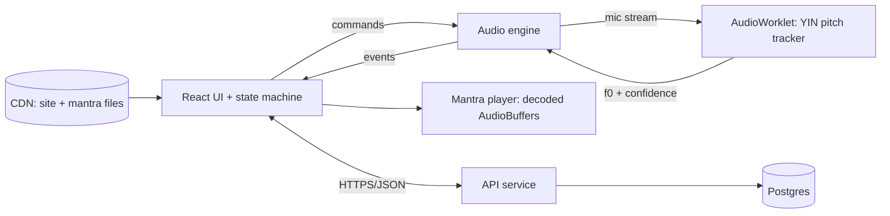

# Technical Requirements Document — Swara Healing (Web)

**Version:** 0.2 draft (website, not an installable app) · **Date:** 24 Sep 2026 · **Status:** for review

## 1. Purpose and scope
A browser-based guided chanting application. The user sings, the app detects their scale and Sa (tonic), the user selects a condition, listens to a chakra mantra in their key, chants it, and receives real-time pitch-accuracy feedback. Each completed run is stored as a session in a 45-day program.

**In scope (v1):** a responsive **website** opened in a browser (no install, no app store), client-side audio analysis, mantra playback, email sign-in, server-stored session history, email reminders.
**Out of scope (v1):** installable PWA, offline mode, push notifications, native apps, clinician dashboard, Raspberry Pi hardware build, any clinical outcome measurement.
**Assumption:** the audience is individuals practicing on their own phone/laptop. A clinic-managed model changes §8 and §11 (see §14).
**Why sign-in:** a website has no durable local storage. Safari can evict a site's IndexedDB/localStorage after 7 days without use, and any user can clear it, which would erase a 45-day program. Progress therefore lives on the server; the browser holds only a cache.

## 2. Condition → mantra mapping (from product spec)
| Condition | Chakra | Swar | Seed mantra | Interval above Sa (just intonation) |
|---|---|---|---|---|
| Diabetes | Manipura | Ga | Ram | 5/4 (386.3 cents) |
| Thyroid | Vishuddha | Pa | Ham | 3/2 (702.0 cents) |
| Hypertension | Anahata | Ma | Yam | 4/3 (498.0 cents) |

## 3. Functional requirements
| ID | Requirement | Acceptance criterion |
|---|---|---|
| FR-1 | Welcome screen with program progress (day N of 45) and medical disclaimer acknowledgement. | Disclaimer must be accepted once before first mic request. |
| FR-2 | Prompt "Please sing a song"; capture up to 15 s; live note + progress display. | Enough-voice gate: ≥3 s of voiced frames, otherwise prompt to continue. |
| FR-3 | Detect key and note set; display "Your scale is <Note> <Major/Minor>", detected notes with share, and confidence. | Manual Sa override always available. |
| FR-4 | Menu: 1 Diabetes, 2 Thyroid, 3 Hypertension. | Selection starts/continues the single active program (§7.3). |
| FR-5 | Play the mantra recording for (condition, Sa, register). Unlimited replay. | Gapless loop; stop/start with <150 ms latency. |
| FR-6 | Button "Go Ahead and start chanting this mantra on the same scale and swara". | Stops playback before mic capture starts (half-duplex). |
| FR-7 | Live accuracy display: "NN% accuracy is there." | Updates ≥4×/s, uses rolling 2 s window. |
| FR-8 | Evaluation gate: after 7.5 s of voiced chanting, mean accuracy ≥90% → show "Continue this chanting for next 10 mins"; else show "Listen that chanting again and repeat step 6" and return to FR-5. | Both thresholds configurable (§6.5). |
| FR-9 | 10-minute hold with countdown. Session completes only if voiced time ≥ configured share (default 50%) of the hold. | Silent wall-clock time does not count. |
| FR-10 | On completion, store Session n and show "Session is over. Stop the device and next day again repeat this. Continue this chanting for next 45 days." | Record persisted before the message is shown. |
| FR-11 | History view (date, condition, key, average accuracy) and day counter. | Same history on any device after sign-in. |
| FR-12 | Daily reminder (opt-in) by email, plus a downloadable calendar (ICS) file. | Reminder sent at the user's chosen local time. |
| FR-13 | Passwordless email sign-in (magic link), sign-out, delete account and all data. | Deletion removes every row for that user. |

## 4. Non-functional requirements
- **Browsers:** Chrome/Edge ≥120 (Android, desktop), Safari ≥16.4 (iOS, macOS; Wake Lock support), Firefox current. AudioWorklet and `getUserMedia` required; unsupported browsers get a clear blocking message.
- **Performance:** DSP ≤2 ms per hop on a mid-range Android; UI 60 fps; first load <3 s on 4G; selected mantra plays <2 s after selection (prefetch on the menu screen). Requires connectivity.
- **Privacy:** audio never leaves the browser and is never stored. The server receives only session aggregates and the account email.
- **Accessibility:** WCAG 2.1 AA; the pitch meter uses position and text, not colour alone; accuracy announcements via rate-limited `aria-live`.
- **i18n:** all strings externalised; English at launch, Hindi and Marathi next.
- **Reliability:** an interrupted session (tab killed, call, lock) is recoverable or cleanly discarded, never half-saved.

## 5. Architecture

**Stack:** Frontend: Vite, TypeScript, React, XState (or a typed reducer), Vitest, Playwright, static hosting on a CDN. Backend: small REST API (Node/TypeScript or Python/FastAPI), Postgres, an email provider for magic links and reminders.

## 6. Audio and DSP specification
### 6.1 Capture
`getUserMedia({audio:{echoCancellation:false, noiseSuppression:false, autoGainControl:false, channelCount:1}})`. Constraints are requests, not guarantees: read `track.getSettings()` and log whether they were honored. A user-selectable input device is required (external and USB mics).

### 6.2 Pitch tracker
- YIN (or pYIN) in an **AudioWorklet**; window 2048 samples, hop 512, any sample rate. Search range 70–800 Hz.
- Voiced if aperiodicity ≤0.15 and level above the calibrated gate. Median filter (5 frames) on f0.
- The worklet posts `{t, f0, conf}`; the main thread never touches raw samples.
- Session clock uses `performance.now()`, never tick counts.

### 6.3 Noise-floor calibration
Before FR-2: 3 s of silence, measure RMS distribution, set gate = max(noise p95 × 3, absolute minimum). If the noise floor is too high, tell the user to move somewhere quieter.

### 6.4 Scale and Sa detection
1. Convert voiced frames to pitch classes (A4=440 Hz). Build a 12-bin histogram.
2. Correlate with the 24 Krumhansl–Schmuckler major/minor profiles. Sa = winning tonic.
3. Show confidence (Pearson r) and runner-up; below r=0.6 show a low-confidence warning.
4. Sa frequency for playback = tonic in the octave nearest the user's median sung pitch.
5. **Feature flag `sa_hold`:** alternative flow where the user holds a comfortable note for 4 s; Sa = median of stable frames (spread <25 cents). Evaluate against the song flow in beta.

### 6.5 Accuracy metric
- Target `T = Sa × ratio(condition)`.
- Per voiced frame: `e = ((1200·log2(f0/T) mod 1200) + 1800) mod 1200 − 600` (cents, octave-invariant); `a = max(0, 100 − 0.5·|e|)`. So 0 cents = 100%, 20 cents = 90%.
- Discard the first 1 s of chanting (onset transient) and frames below the confidence threshold.
- Evaluation gate (FR-8): mean of `a` over the first 7.5 s of voiced frames. Display (FR-7): rolling 2 s mean.
- Config: `passThreshold=90`, `evalVoicedSeconds=7.5`, `holdMinutes=10`, `minVoicedShare=0.5`, `tuning="just"`.

> **Design risk:** just intonation vs 12-tone equal temperament differs by 13.7 cents for Ga (5/4 vs 400 cents) and about 2 cents for Ma/Pa. With a 20-cent tolerance at 90%, the tuning choice for Ga consumes most of the margin. The reference recording and the scoring target **must use the same tuning**.

## 7. Application logic
### 7.1 State machine
| State | Event → next |
|---|---|
| WELCOME | begin → MIC_PERMISSION |
| MIC_PERMISSION | granted → CALIBRATE; denied → ERROR(mic) |
| CALIBRATE | done → SING |
| SING | enough voice or 15 s → SCALE_RESULT |
| SCALE_RESULT | confirm (with optional Sa override) → MENU |
| MENU | select → LISTEN |
| LISTEN | play/stop (self loop); go ahead → CHANT_EVAL |
| CHANT_EVAL | mean ≥ threshold → CHANT_HOLD; below → RETRY |
| RETRY | acknowledge → LISTEN |
| CHANT_HOLD | timer done and voiced-share met → SESSION_DONE; voiced-share missed → RETRY_SHORT |
| SESSION_DONE | home → WELCOME |
Any state: audio interruption → PAUSED (timer stops counting); resume or discard.

### 7.2 Session rules
- A session is stored only at SESSION_DONE. "End session now" exists in debug builds only.
- One counted session per local calendar day (a second run is allowed but not counted toward the 45).

### 7.3 Program rules (defaults, confirm with product)
One active program at a time (locked condition); Sa re-detected each session with the previous Sa offered as a starting point; missed days do not reset the counter.

## 8. Data model (Postgres; the browser keeps only a non-authoritative cache)
```
program { id, condition, startedAt, tuning, active }
session { id, programId, dayIndex, startedAt, endedAt, saPc, saHz, evalAccuracy,
          meanAccuracy, voicedSeconds, completed, appVersion }
user { id, email, createdAt, locale, reminderTime, disclaimerAcceptedAt, consentVersion }
(inputDeviceId stays in the browser only)
```
No audio, no free text, no device identifiers. Encrypt at rest; provide **Export** (JSON) and **Delete account and all data**.

## 9. Mantra content
- Recorded by a trained singer, one file per (condition, Sa pitch class, register): 3 × 12 × 2 registers = **72 files**. Loop unit: one "Ram/Ham/Yam" repetition plus drone.
- Master 48 kHz mono 24-bit WAV; delivered as AAC (.m4a) for universal support; served from `/mantras/<condition>/<sa>-<register>.m4a`.
- **Pitch QA in CI:** an offline script measures each delivered file's sustained pitch after encoding; fail the build if |error| >5 cents from the target.
- Manifest JSON with version and SHA-256 per file; the site prefetches only the selected condition's files (~200 KB each) from the CDN with long-lived cache headers.
- Fallback for development: the synthesized tone from the prototype.

## 10. Platform requirements
- HTTPS only; responsive layout for phone, tablet and desktop; no install prompt, service worker or offline mode.
- The whole flow lives in one page load (client-side routing, no full reloads): Safari can re-prompt for mic permission on each new page load.
- Screen Wake Lock during LISTEN, CHANT_EVAL and CHANT_HOLD where supported; re-acquire on `visibilitychange`. Where unsupported, warn that screen sleep will pause the session.
- `AudioContext` created and resumed on a user gesture (iOS). On interruption, suspend the session clock.
- Bluetooth headsets: detect narrowband input (<16 kHz sample rate) and warn; recommend wired or built-in mic.
- Half-duplex audio: never play the mantra while the mic is analysing, unless headphones are confirmed by the user.

## 11. Security, privacy and compliance
- The server now holds health-adjacent data (selected condition, session history) tied to an email: personal data under the DPDP Act 2023. Requirements: explicit consent notice and purpose limitation, data minimisation (§8), encryption in transit and at rest, retention limits, breach process, deletion on request, India-region hosting where feasible. Compliance review before beta.
- Age gate: require 18+ self-declaration (DPDP treats under-18 data with verifiable parental consent).
- CSP: no third-party scripts; strict `script-src 'self'`; no analytics that include condition selection. Magic links single-use and expiring (15 min); rate-limit sign-in and API.
- **Claims and copy:** present as a guided chanting practice, not treatment. Persistent notice: this does not replace medical care; do not change medication without a doctor. Legal review of wording (CDSCO exposure) before public release.

## 12. Testing and acceptance
| Area | Test | Pass criterion |
|---|---|---|
| Pitch tracker | Synthetic tones 100–800 Hz, harmonic-rich vowel synth | Error <5 cents clean; <10 cents at 10 dB SNR |
| Robustness | Vibrato (±30 cents, 5.5 Hz), glides, octave jumps, silence, broadband noise | No false voiced frames in silence/noise; octave errors do not change accuracy score |
| Metric | Known cent offsets 0…100 | Score matches formula exactly; monotonic |
| Key detection | Labelled corpus of ≥100 real recordings (to be collected) | Report top-1 accuracy; target ≥85% before launch, or ship `sa_hold` |
| Timing | 10-min session with tab backgrounded / screen locked | Voiced-time accounting correct; no false completion |
| E2E | Playwright with Chromium fake-audio-capture files | Full flow passes for pass and retry paths |
| Devices | Low/mid/high Android (Chrome), iPhone (Safari and Chrome-on-iOS), Windows and Mac laptops, wired USB mic, Bluetooth headset | Documented result per device and browser |
| Auth and data | Sign in on a second device; delete account | History follows the user; deletion removes all rows |
| Content | 72 mantra files | All within ±5 cents |

## 13. Milestones (indicative)
1. **M0 — DSP (1–2 wk):** worklet YIN, calibration, synthetic-signal test harness.
2. **M1 — Flow (1–2 wk):** state machine, all screens, metric, fake-audio E2E.
3. **M2 — Content and backend (2 wk):** recorded mantras, CI pitch QA, sign-in, API and database, email reminders, wake lock.
4. **M3 — Beta (2 wk):** 15–20 users across devices; collect key-detection corpus; tune thresholds.
5. **M4 — Release:** legal copy review, accessibility audit, launch.

## 14. Risks and open questions
| # | Item | Impact / default |
|---|---|---|
| 1 | Individual vs clinic-managed use | Clinic use adds roles, patient consent and a dashboard. Default: individual users with email sign-in. |
| 2 | Tuning system (just vs equal) | See §6.5 risk. Default: just intonation, single config flag. |
| 3 | Who records mantras and to what pitch spec | Blocks M2. |
| 4 | Song-based key detection accuracy on free singing | May fail the ≥85% target; fallback `sa_hold`. |
| 5 | Phone audio pipeline (AGC, noise suppression, Bluetooth) | Calibration and device warnings; beta device matrix. |
| 6 | Medical-claim / regulatory position | Copy review before release. |
| 7 | Retention over 45 days | Reminders; measure day-7 and day-45 drop-off in beta. |
| 8 | Missed-day and re-detected-Sa policy | Defaults in §7.3, confirm. |
| 9 | Sign-in friction vs data-custody risk | Sign-in fixes browser-storage eviction but makes you custodian of health-adjacent data. Alternative: no accounts, export/import file, accept possible loss. Decide before M2. |
