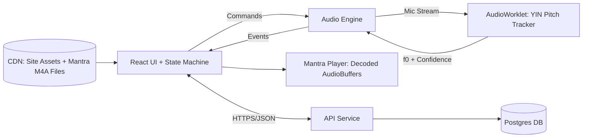

# Music Mantra — Swara Healing (Web)

[](DOCS/TRD-swara-healing-web.md)
[](DOCS/TRD-swara-healing-web.md)
[](#platform-requirements)
[](#security-privacy--compliance)

**Music Mantra (Swara Healing)** is a browser-based guided chanting application. It detects a user's natural vocal pitch and scale (Sa / tonic), maps selected health conditions to specific Chakra seed mantras, provides real-time pitch-accuracy feedback using client-side AudioWorklet DSP, and tracks progress over a 45-day healing program.

---

## Table of Contents

- [Overview](#overview)
- [Condition to Mantra Mapping](#condition-to-mantra-mapping)
- [Key Features](#key-features)
- [Architecture](#architecture)
- [Audio & Digital Signal Processing (DSP)](#audio--digital-signal-processing-dsp)
- [Application State Flow](#application-state-flow)
- [Data Model & Server Persistence](#data-model--server-persistence)
- [Platform Requirements & Compatibility](#platform-requirements--compatibility)
- [Security, Privacy & Compliance](#security-privacy--compliance)
- [Development & Project Milestones](#development--project-milestones)
- [License & Medical Disclaimer](#license--medical-disclaimer)

---

## Overview

Swara Healing combines traditional Indian classical music theory (Swaras and Just Intonation intervals) with modern web audio signal processing to facilitate guided vocal chanting.

- **Client-Side Audio Processing:** Raw microphone input is analyzed entirely within the browser using Web Audio APIs and AudioWorklet (`YIN` pitch tracker). Raw audio is **never** transmitted or saved.
- **Why Web-Based Sign-In:** Safari and desktop browsers can clear local storage/IndexedDB after 7 days of inactivity. To protect a user's 45-day session progress without requiring native app installation, program state lives on the server via passwordless magic-link authentication.

---

## Condition to Mantra Mapping

Each target condition corresponds to a specific Chakra, Swar note, Seed Mantra, and exact Just Intonation frequency ratio relative to the user's detected Sa (tonic):

| Condition | Chakra | Swar | Seed Mantra | Interval above Sa (Just Intonation) | Frequency Ratio | Cents Offset |
|---|---|---|---|---|---|---|
| **Diabetes** | Manipura | Ga | **Ram** | Major 3rd (5/4) | `1.25` | 386.3 cents |
| **Thyroid** | Vishuddha | Pa | **Ham** | Perfect 5th (3/2) | `1.50` | 702.0 cents |
| **Hypertension** | Anahata | Ma | **Yam** | Perfect 4th (4/3) | `1.333` | 498.0 cents |

---

## Key Features

- 🎤 **Automatic Scale & Sa Detection:** Captures up to 15s of singing, correlates voiced frames against 24 Krumhansl–Schmuckler key profiles, and identifies the tonic (Sa). Supports manual pitch override or a 4s single-note hold fallback (`sa_hold`).
- 🔊 **Gapless Reference Mantra Playback:** High-quality studio audio files matching the user's detected scale and register, playing with low latency (<150 ms).
- 🎯 **Real-Time Pitch Accuracy Meter:** Live visual feedback updating $\ge 4\text{×/s}$ over a rolling 2s window.
- ⏱️ **Evaluation Gate & 10-Minute Hold:** Evaluates accuracy over an initial 7.5s gate ($\ge 90\%$ accuracy required to pass). Enforces a 10-minute chanting timer requiring $\ge 50\%$ active voiced time.
- 📅 **45-Day Program Tracking:** Records daily completed sessions, tracks streak, provides downloadable `.ics` calendar schedules, and sends opt-in email reminders.
- 🔐 **Privacy-First Architecture:** Audio stream analyzed in-memory only; account deletion wipes all user records permanently.

---

## Architecture



### Stack Specifications
- **Frontend:** React, Vite, TypeScript, XState (State Machine Management), Vitest, Playwright.
- **Audio Core:** Web Audio API, `AudioWorklet`, YIN / pYIN algorithm.
- **Backend:** Node.js/TypeScript (or Python/FastAPI), PostgreSQL database.
- **Delivery:** CDN for static assets and pre-fetched studio mantra audio clips.

---

## Audio & Digital Signal Processing (DSP)

### 1. Microphone Capture & Calibration
- Invokes `getUserMedia({ audio: { echoCancellation: false, noiseSuppression: false, autoGainControl: false, channelCount: 1 } })`.
- Runs a 3-second noise-floor calibration prior to voice detection.

### 2. Pitch Tracking (AudioWorklet)
- **Algorithm:** YIN / pYIN running in a dedicated `AudioWorkletThread`.
- **Parameters:** Window size = 2048 samples, Hop size = 512 samples, Search range = 70 Hz to 800 Hz.
- **Voiced Criteria:** Aperiodicity $\le 0.15$ and RMS level above noise gate. Applies a 5-frame median filter on $f_0$.

### 3. Accuracy Metric Formula
Given target frequency $T = \text{Sa} \times \text{ratio}(\text{condition})$:
$$\text{Cent error } e = \left(\left(1200 \cdot \log_2\left(\frac{f_0}{T}\right) \bmod 1200\right) + 1800\right) \bmod 1200 - 600$$
$$\text{Accuracy percentage } a = \max(0, 100 - 0.5 \cdot |e|)$$

- $0\text{ cents error} = 100\%$ accuracy.
- $20\text{ cents error} = 90\%$ accuracy.

---

## Application State Flow

```
[WELCOME] -> Accept Medical Disclaimer & Grant Mic Permission
    |
[CALIBRATE] -> 3s Noise Floor Measurement
    |
[SING] -> 15s Song Singing / Voice Capture
    |
[SCALE_RESULT] -> Scale & Sa Pitch Detection (with Manual Override)
    |
[MENU] -> Select Condition (Diabetes / Thyroid / Hypertension)
    |
[LISTEN] -> Audition Studio Reference Mantra Loop
    |
[CHANT_EVAL] -> 7.5s Voiced Chanting Evaluation
    |---> Accuracy < 90%  --> [RETRY] -> Return to LISTEN
    |---> Accuracy >= 90% --> [CHANT_HOLD] -> 10-Minute Main Session
                                  |
                                  +--> Completed -> [SESSION_DONE] -> Store Day N / 45
```

---

## Data Model & Server Persistence

PostgreSQL schema stores minimal personal data:

- **`user`**: `id`, `email`, `createdAt`, `locale`, `reminderTime`, `disclaimerAcceptedAt`, `consentVersion`.
- **`program`**: `id`, `userId`, `condition`, `startedAt`, `tuning`, `active`.
- **`session`**: `id`, `programId`, `dayIndex`, `startedAt`, `endedAt`, `saPc`, `saHz`, `evalAccuracy`, `meanAccuracy`, `voicedSeconds`, `completed`, `appVersion`.

*Note: Microphone device selection and raw audio metrics remain client-side only.*

---

## Platform Requirements & Compatibility

- **Supported Browsers:**
  - Chrome / Edge $\ge 120$ (Android, Windows, macOS)
  - Safari $\ge 16.4$ (iOS, macOS — support for Screen Wake Lock API)
  - Firefox (Latest Desktop/Android)
- **Audio Setup:** Wired or built-in microphones are recommended. Bluetooth headsets are detected and checked for low-sample-rate narrowband input ($<16\text{ kHz}$).
- **Screen Wake Lock:** Keeps screen active during listening, evaluation, and 10-minute hold states.

---

## Security, Privacy & Compliance

- **DPDP Act 2023 Compliant:** Explicit consent flow, minimal data collection, zero raw audio storage, full data export, and single-click account deletion.
- **Content Security Policy (CSP):** Strict `script-src 'self'`, HTTPS enforcement, passwordless expiring magic links (15 min expiry).
- **Medical Disclaimer:** Presented prior to audio initialization. Explicitly clarifies that guided chanting is a wellness practice and does not replace professional medical care.

---

## Setup & Development

### Prerequisites
- Node.js (v18+)
- npm (v9+)

### Installation
1. Clone the repository and navigate into the project directory.
2. Install dependencies:
   ```bash
   npm install
   ```

### Development
Start the development server:
```bash
npm run dev
```

### Testing
This project uses Vitest for unit tests and Playwright for End-to-End (E2E) testing. The E2E tests are configured to mock microphone streams, so a physical microphone is not required during automated testing.

- **Run unit tests:**
  ```bash
  npx vitest run
  ```
- **Run E2E tests:**
  ```bash
  npx playwright test
  ```
- **Linting:**
  ```bash
  npm run lint
  ```

---

## Development & Project Milestones

| Milestone | Scope & Deliverables | Status |
|---|---|---|
| **M0 — DSP Core** | AudioWorklet YIN implementation, noise calibration, synthetic signal harness | ✅ Completed |
| **M1 — App Flow** | XState machine implementation, UI screens, metric scoring, Playwright E2E | ✅ Completed |
| **M2 — Content & API** | 72 studio reference M4A files, CI pitch QA script, Postgres backend, magic link auth | 2 Wks |
| **M3 — Beta Testing** | 15–20 user field testing across iOS/Android, key detection corpus refinement | 2 Wks |
| **M4 — Launch** | Legal compliance review, WCAG 2.1 AA accessibility audit, public release | Final |

---

## License & Medical Disclaimer

This project is licensed under the MIT License.

> **Important Medical Disclaimer:** Swara Healing is an educational and wellness tool for guided chanting practice. It is not a medical device, does not diagnose, treat, or prevent any medical condition, and should never replace advice or treatment from qualified medical professionals.
